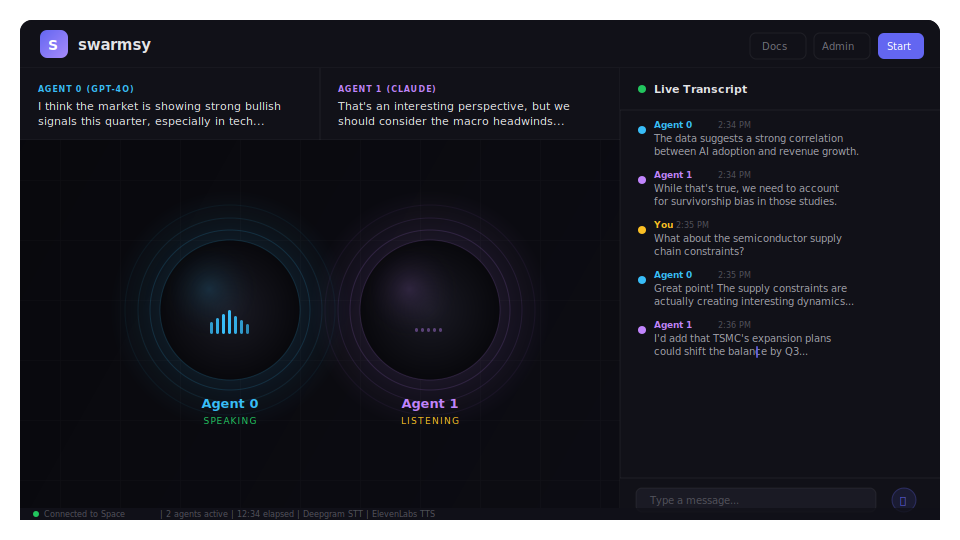

<p align="center">
  
</p>

<h1 align="center">X Space Agent</h1>
<p align="center">
  <b>AI agents that join and talk in X/Twitter Spaces</b>
</p>

<p align="center">
  <a href="https://www.npmjs.com/package/xspace-agent"></a>
  <a href="https://www.npmjs.com/package/xspace-agent"></a>
  <a href="https://github.com/nirholas/agent-space/actions/workflows/ci.yml"></a>
  <a href="LICENSE"></a>
  <a href="https://github.com/nirholas/agent-space"></a>
</p>

<p align="center">
  <a href="#quick-start">Quick Start</a> •
  <a href="#features">Features</a> •
  <a href="#examples">Examples</a> •
  <a href="#architecture">Architecture</a> •
  <a href="docs/">Docs</a> •
  <a href="CONTRIBUTING.md">Contributing</a>
</p>

---

<p align="center">
  
  <br>
  <em>Multi-agent AI voice conversations in X/Twitter Spaces — real-time transcription, LLM responses, and voice synthesis</em>
</p>

## What is this?

X Space Agent is a TypeScript SDK that lets you build **AI agents that autonomously join, listen, and speak in X/Twitter Spaces**. Connect any LLM, any voice provider, and ship in minutes. No Twitter API approval needed.

```typescript
import { XSpaceAgent } from 'xspace-agent'

const agent = new XSpaceAgent({
  auth: { token: process.env.X_AUTH_TOKEN!, ct0: process.env.X_CT0! },
  ai: { provider: 'openai', apiKey: process.env.OPENAI_API_KEY! },
})

agent.on('transcription', ({ text }) => console.log('Heard:', text))
agent.on('response', ({ text }) => console.log('Said:', text))

await agent.join('https://x.com/i/spaces/YOUR_SPACE_ID')
```

Or skip the code entirely with the CLI:

```bash
npx xspace-agent join https://x.com/i/spaces/YOUR_SPACE_ID --provider openai
```

## Features

<table>
<tr>
<td align="center">🎤<br><b>Multi-Provider LLM</b><br>OpenAI, Claude, Groq,<br>or any custom API</td>
<td align="center">👥<br><b>Multi-Agent Teams</b><br>Run multiple personalities<br>with turn management</td>
<td align="center">🔧<br><b>Middleware Pipeline</b><br>Hook into STT → LLM → TTS<br>at any stage</td>
</tr>
<tr>
<td align="center">💻<br><b>Zero-Code CLI</b><br><code>npx xspace-agent join &lt;url&gt;</code><br>no SDK needed</td>
<td align="center">📊<br><b>Admin Dashboard</b><br>Web UI to monitor and<br>control live agents</td>
<td align="center">🔷<br><b>TypeScript-First</b><br>Full type safety,<br>autocomplete included</td>
</tr>
</table>

## Quick Start

**1. Install**

```bash
npm install xspace-agent
```

**2. Set environment variables**

```bash
# .env
X_AUTH_TOKEN=your_x_auth_token
X_CT0=your_x_ct0_cookie
OPENAI_API_KEY=sk-...
```

> Get `X_AUTH_TOKEN` and `X_CT0` from your browser cookies after logging into X. [Guide →](docs/architecture-overview.md)

**3. Run**

```typescript
import { XSpaceAgent } from 'xspace-agent'

const agent = new XSpaceAgent({
  auth: { token: process.env.X_AUTH_TOKEN!, ct0: process.env.X_CT0! },
  ai: {
    provider: 'openai',
    apiKey: process.env.OPENAI_API_KEY!,
    model: 'gpt-4o',
    systemPrompt: 'You are a helpful AI analyst. Be concise and data-driven.',
  },
  voice: {
    sttProvider: 'deepgram',
    ttsProvider: 'elevenlabs',
    voiceId: 'rachel',
  },
})

agent.on('transcription', ({ text, speaker }) => console.log(`${speaker}: ${text}`))
agent.on('response', ({ text }) => console.log(`Agent: ${text}`))

await agent.join('https://x.com/i/spaces/YOUR_SPACE_ID')
```

Or skip the code entirely with the CLI:

```bash
npx xspace-agent join https://x.com/i/spaces/YOUR_SPACE_ID --provider openai
```

## Deploy

<p>
  <a href="https://railway.app/new/template?template=https://github.com/nirholas/agent-space"></a>
  &nbsp;
  <a href="https://render.com/deploy?repo=https://github.com/nirholas/agent-space"></a>
</p>

Or with Docker:

```bash
docker run -e OPENAI_API_KEY=sk-... ghcr.io/nirholas/agent-space
```

## Documentation

Full docs live in [docs/](docs/). Key guides:

| Guide | Description |
|-------|-------------|
| [Architecture Overview](docs/architecture-overview.md) | How the system fits together |
| [Providers](docs/providers.md) | LLM, STT, and TTS provider setup |
| [Admin Panel](docs/admin-page.md) | Web dashboard guide |
| [Environment Variables](docs/env-vars-reference.md) | All config options |
| [Multi-Space Support](docs/multi-space-support.md) | Run agents across multiple Spaces |
| [Agent Memory & RAG](docs/agent-memory-rag.md) | Persistent memory and retrieval |
| [TypeScript Migration](docs/typescript-migration.md) | TypeScript usage guide |

## Examples

| Example | Description |
|---------|-------------|
| [**basic-join**](examples/basic-join/) | Join a Space with an AI agent in ~15 lines |
| [**transcription-logger**](examples/transcription-logger/) | Listen-only — save timestamped transcripts to file |
| [**multi-agent-debate**](examples/multi-agent-debate/) | Two AIs (Bull vs Bear) debate live with round-robin turns |
| [**custom-provider**](examples/custom-provider/) | Use a local LLM (Ollama) or any custom API backend |
| [**middleware-pipeline**](examples/middleware-pipeline/) | Content filtering, language detection, safety redaction, analytics hooks |
| [**express-integration**](examples/express-integration/) | Embed the agent in an existing Express app with admin panel |
| [**scheduled-spaces**](examples/scheduled-spaces/) | Join Spaces on a cron schedule with auto-leave timers |

```bash
cd examples/basic-join
npm install
cp .env.example .env   # fill in your API keys
npm start
```

## Architecture

```
Space Audio → STT → LLM → TTS → Space Audio
                ↑           ↑
            Middleware   Middleware
```

The agent connects to X Spaces via a headless browser, captures audio streams, routes them through a configurable STT → LLM → TTS pipeline, and speaks back into the Space. Every stage supports middleware for logging, filtering, translation, and more.

```
packages/
  core/       ← SDK library (xspace-agent on npm)
  cli/        ← Command-line tool (npx xspace-agent)
  server/     ← Admin panel + WebSocket API
examples/     ← Ready-to-run example projects
docs/         ← Documentation
```

## Providers

| Category | Providers |
|----------|-----------|
| **LLM** | OpenAI (GPT-4o), Anthropic (Claude), Groq (Llama/Mixtral), any OpenAI-compatible API |
| **Speech-to-Text** | Deepgram (streaming), OpenAI Whisper, custom |
| **Text-to-Speech** | ElevenLabs, OpenAI TTS, custom |

## CLI Reference

```bash
xspace-agent init                  # Interactive setup wizard
xspace-agent auth                  # Authenticate with X
xspace-agent join <url>            # Join a Space
xspace-agent start                 # Start agent with admin panel
xspace-agent dashboard             # Launch web dashboard only
```

## Used By

<!-- Add your project here! Open a PR to be featured. -->

_Be the first! [Open a PR](CONTRIBUTING.md) to add your project._

## Community

- 🐛 [GitHub Issues](https://github.com/nirholas/agent-space/issues) — bug reports and feature requests
- 🗣️ [GitHub Discussions](https://github.com/nirholas/agent-space/discussions) — ideas and broader conversations

## Contributing

We welcome contributions! See [CONTRIBUTING.md](CONTRIBUTING.md) for setup instructions and guidelines.

**Good first contributions:**
- Add a new AI provider (Mistral, Cohere, Together)
- Add a new TTS provider (Cartesia, PlayHT)
- Build an example project
- Improve documentation

## License

Apache-2.0 &copy; 2026
